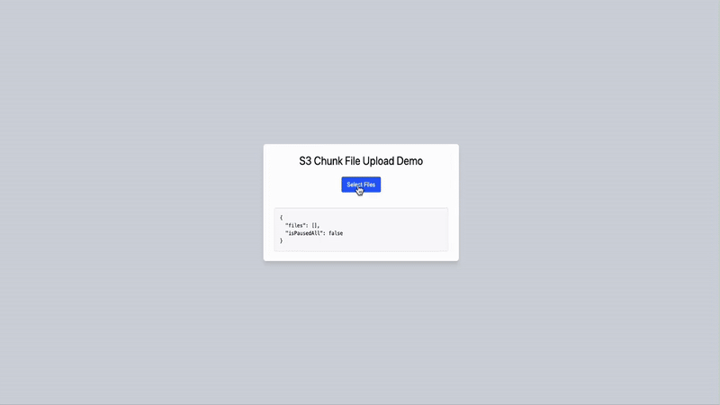

# s3 chunk file upload

`s3 chunk file upload` is a React & Node based file uploader that enables chunk-by-chunk file uploads to AWS S3. It features a modern UI with upload progress tracking and pause/resume functionality for both individual files and batch operations. It is not production-ready and is intended for educational purposes only.

## Features

- 📦 Chunk-by-chunk file upload
- 🚀 Concurrent file uploads
- ⏸️ Individual and batch pause/resume functionality
- 🗳️ Individual and batch cancel operations
- 📊 Real-time upload progress tracking
- 🎯 Default chunk size of 5MB
- 🎨 Modern UI with Tailwind CSS
- 🔄 Sequential chunk upload per file
- ⚡ State management with React hooks

## Demo

<!--  -->

<!-- https://github.com/mones-cse/s3-chunk-file-upload/demo.mp4 -->

https://github.com/user-attachments/assets/57d86c8a-5179-4281-baee-31d72df10f9f

## How It Works

1. Multiple files can be selected and uploaded concurrently
2. Each file is processed independently:
   - Split into 5MB chunks
   - Initial request to `/api/upload/init` provides upload URL and uploadId
   - Chunks are uploaded sequentially to `/api/upload/chunk`
   - Each chunk request includes: chunk data, part number, uploadId, key
3. Progress tracking:
   - Individual progress per file
   - Status updates for each chunk
   - Upload state management (active, paused, completed)
4. Control features:
   - Pause/Resume individual files
   - Pause/Resume all uploads
   - Cancel individual file upload
   - Cancel all uploads
5. Cleanup:
   - Automatic cleanup on cancel
   - Proper abort handling for incomplete uploads

## Tech Stack

- Node.js
- React 19
- TypeScript
- Tailwind CSS
- AWS SDK
- Vite

## State Management

- Uses React's useState and useRef hooks
- Maintains file states in a Map data structure
- Tracks upload progress and state per file
- Global pause state for batch operations
- AbortController for upload cancellation

## Setup

Clone the repository:

```bash
git clone git@github.com:mones-cse/s3-chunk-file-upload.git
cd s3-chunk-file-upload
```

Install dependencies for both fornend and backend:

for backend: it will run on port 5001

```bash
cd backend
pnpm install
pnpm dev
````

for forntend: it will run on port 3000

```bash
cd frontend
pnpm install
pnpm dev
```

## Configuration

Create a `.env` file in the `backend` directory with the following content:

```env
AWS_ACCESS_KEY_ID=your-access-key-id
AWS_SECRET_ACCESS_KEY=your-secret-access-key
AWS_REGION=your-region
S3_BUCKET_NAME=your-bucket-name
PORT=5001
```

## API Endpoints

The uploader interacts with the following endpoints:

- `POST /api/upload/init:` Initialize upload and get uploadId
- `POST /api/upload/chunk:` Upload individual chunks
- `POST /api/upload/complete:` Complete multipart upload
- `POST /api/upload/abort:` Abort incomplete uploads

## License

[MIT](https://choosealicense.com/licenses/mit/)
