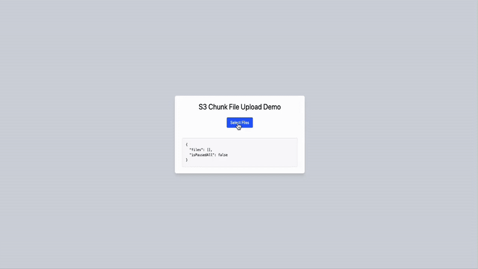

# ChunkVault

ChunkVault is a React-based file uploader that enables chunk-by-chunk file uploads to AWS S3. It features a modern UI with upload progress tracking and pause/resume functionality for both individual files and batch operations. It is not production-ready and is intended for educational purposes only.

## Features

- 📦 Chunk-by-chunk file upload
- 🚀 Concurrent file uploads
- ⏸️ Individual and batch pause/resume functionality
- 🗑️ Individual and batch cancel operations
- 📊 Real-time upload progress tracking
- 🎯 Default chunk size of 5MB
- 🎨 Modern UI with Tailwind CSS
- 🔄 Sequential chunk upload per file
- ⚡ State management with React hooks

## Demo



## How It Works

1. Multiple files can be selected and uploaded concurrently
2. Each file is processed independently:
   - Split into 5MB chunks
   - Initial request to `/api/upload/init` provides upload URL and uploadId
   - Chunks are uploaded sequentially to `/api/upload/chunk`
   - Each chunk request includes: chunk data, part number, uploadId, key
3. Progress tracking:
   - Individual progress per file
   - Status updates for each chunk
   - Upload state management (active, paused, completed)
4. Control features:
   - Pause/Resume individual files
   - Pause/Resume all uploads
   - Cancel individual files
   - Cancel all uploads
5. Cleanup:
   - Automatic cleanup on cancel
   - Proper abort handling for incomplete uploads

## Tech Stack

- React 19
- TypeScript
- Tailwind CSS
- AWS SDK
- Vite

## State Management

- Uses React's useState and useRef hooks
- Maintains file states in a Map data structure
- Tracks upload progress and state per file
- Global pause state for batch operations
- AbortController for upload cancellation

## Setup

Clone the repository:

```bash
git clone https://github.com/mones-cse/chunkvault.git
cd chunkvault
```

Install dependencies:

```bash
pnpm install
```

3. Run the development server:

```bash
pnpm dev
```

## API Endpoints

The uploader interacts with the following endpoints:

- `POST /api/upload/init:` Initialize upload and get uploadId
- `POST /api/upload/chunk:` Upload individual chunks
- `POST /api/upload/complete:` Complete multipart upload
- `POST /api/upload/abort:` Abort incomplete uploads

## License

[MIT](https://choosealicense.com/licenses/mit/)
